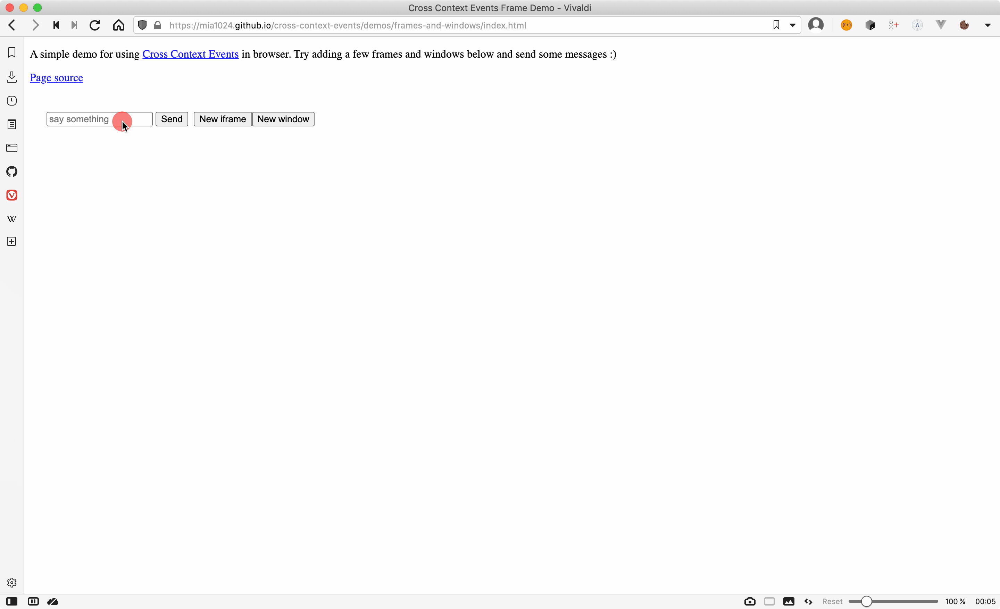

# Cross Context Events


Cross context events is a robust, lightweight package providing 
the option to send and receive events across JS execution context. 

You asked, what does this mean, exactly? Well, it means that when you emit an
event in your script, the same event will also be emitted in all other linked execution contexts (i.e. other tabs, windows, processes), even on different computers if you want to! All you need to do is writing a few lines of code to link them together. 



[Try the demo here](https://mia1024.github.io/cross-context-events/demos/frames-and-windows/)    [Source code for the demo](https://github.com/mia1024/cross-context-events/tree/main/docs/demos/frames-and-windows)

## Documentations and getting started

See [here](https://mia1024.github.io/cross-context-events/).

## Installation
yarn
```bash
yarn add cross-context-events
```

npm
```bash 
npm install cross-context-events
```

## Features

- Lightweight
- No runtime dependency
- Containerization
    - Support for named and anonymous containers to provide isolation if you need
- Unified interface
    - Works in Node and browser exactly the same way
- Cross Context
    - Capable of sending events across execution context (e.g. from one tab to 
      another tab in browser or from one process to another process in Node) 
      with minimal setup, so long as an IPC channel can be established between
      the sending context and receiving context.
    - Relay support: events can be optionally relayed across the network if 
      you have one, see below for details.
- Typescript support
    - In fact, `cross-context-events` is written in typescript.
- Comprehensive testing
    - All core functions are unittested
- Namespaced events and bubbling
    - If you emit an event for `event.context.new`, then listeners for 
      `event.context` and `event` are also notified (but `event.context2` is not). 
      This behavior can be disabled if desired.
      
