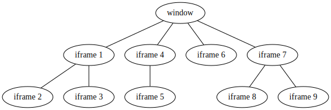

# Introduction

Cross context events is a lightweight event library written in Typescript for
event synchronization. It can be used as a simple replacement for the built-in
event mechanism for both Node and browser as well as a powerful library for
emitting events across multiple execution contexts.

## A quick demo


[Try the demo here](https://mia1024.github.io/cross-context-events/demos/frames-and-windows/)
&nbsp;&nbsp;&nbsp;&nbsp;&nbsp;  [Source code for the demo](https://github.com/mia1024/cross-context-events/tree/main/docs/demos/frames-and-windows)

## Installation

Unpkg

```html
<script src="https://unpkg.com/cross-context-events/dist/cross-context-events.min.js"></script>
```

jsDelivr

```html
<script src="https://cdn.jsdelivr.net/npm/cross-context-events/dist/cross-context-events.min.js"></script>
```

yarn

```bash
yarn add cross-context-events
```

npm

```bash
npm install cross-context-events
```

Note: while this package has no runtime dependencies, it does have quite a few
dev dependencies. Therefore, it is recommended that you install this package
without the `--dev` flag if possible, especially if you are not using a package
bundler such as webpack.

Compile from source

```bash
git clone git@github.com:mia1024/cross-context-events
yarn && yarn pack
```

## Features

- Lightweight
- No runtime dependency
- Comprehensive [documentations](/)
- Containerization
    - Support for named and anonymous containers to provide isolation if you
      need
- Unified interface
    - Works the same way whether you are using browser, service worker, node, or
      even electron.
- Cross Context
    - Capable of sending events across execution context (e.g. from one tab to
      another tab in browser or from one process to another process in Node)
      with minimal setup, so long as an IPC channel can be established between
      the sending context and receiving context.
    - Relay support: events can be optionally relayed across the network if you
      have one.
- Typescript support
    - Written completely in typescript completely with strong type inferences.
- Comprehensive testing
    - All core functions are unittested
- Namespaced events and bubbling
    - If you emit an event for `event.context.new`, then listeners for
      `event.context` and `event` are also notified (but `event.context2` is
      not). This behavior can be disabled if desired.
      See [event bubbling](events?id=event-bubbling).
- Event relaying
    - Even if you have a network of nested iframes like the image below, and you
      emit an event in iframe 9, it will be emitted in all frames and the parent
      window. This also applies to a chain or child processes or workers or any
      other combinations of communication channels. See [event relaying](transports?id=event-relaying).
      
      

## Why

An event, if happened, should be raised everywhere in your application, no
matter where the listener is located: in the same script, in a different script,
in a different thread, in a different process, or even on a different machine.

## Why (the long version)

Both Node and modern browsers support custom events, however they don't really
make sense (calling something `Emitter`? Really?). They also don't have any
support for namespace and containerization. Most importantly:

- Events are passed as strings instead of objects, which means if you ever
  decide to change the name of some events, you need to try really hard to hunt
  down every single occurrence of that string (if you have dynamically
  calculated string in runtime? Good luck, I will pray for you). Also, you can
  never be sure what kind of data you will get from a particular event's
  payload (or maybe you are sure, but typescript isn't).
- No support for cross context execution. While you can always spawn IPC
  channels and maintain them yourself, doing so is error prone and you might
  have flying messages that are hard to trace (again, partially because IPC
  messages are strings too)
- There are some subtle functional and syntactical differences between the
  browser events and Node events, so that code written for Node cannot be easily
  executed in the browser and vice versa without having to rewrite the event
  interfaces.

## What did this package do differently

To address the issues above, `cross-context-events` was created. It was
originally created to support executing the same set of code that can run both
as web pages (uses `window.postMessage`) and as a browser extension (uses
`browser.runtime.sendMessage`). The specific solutions to the issues above are

- All events are maintained as objects and they can be imported/exported between
  modules. If you want to rename it, you can just change the name from where the
  event was created and your IDE can just track down all the usages of that
  variable and rename all of them.
    - If you really want to pass a string for some reason, you can always use
      `getEvent(name)` to get the object, although this would lose the benefit
      mentioned above
    - If you use typescript, it can infer the data type in all event creation
      and in listeners. For example, if you created an event with
      `const Event=createEvent<number>("foo.bar")`, then when you do
      `Event.addListener(e => someVariable += e.data)`, typescript knows that
      `e.data` is of type number.
- Built-in support for cross-context executions (after all, this is what the
  package was mostly written for). If you can somehow communicate between the
  contexts (e.g. if you can use `window.postMessage`) or even using a server as
  a proxy and use a WebSocket. So long as communication can be established, you
  can just use a few lines of configuration to tell the package how to use that
  channel (see [Transports](transports)) and it will handle everything else.
    - If, you have a mini-network and do not have direct communication between
      some nodes of the network, you can configure `cross-context-events` to
      relay the information between nodes.
      See [event relaying](transports?id=event-relaying).
- Even if you don't use the cross context execution feature, you can still enjoy
  all other benefits from this package, and it's very lightweight so you can
  just add it without any trouble. For one thing, you can run it in both Node
  and browser without having to rewrite any code if you don't use the
  cross-context feature.

Note: to maintain performance, no runtime type checking is performed. This means
that if you pass in the wrong argument types, you might get some very cryptic
errors (most likely something is undefined or something is not a function)
If this is an issue for you, consider using Typescript instead.

## What's next

- [Quickstart](quickstart)
- [Events](events.md)
- [Containers](containers)
- [Transports](transports)
- [Typescript support](typescript)
- [API Reference](api)
