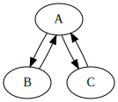
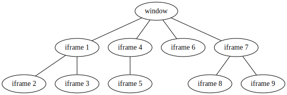

# Transports

Transports are the core of this library. They are what made this library
powerful and enables emitting events cross context. Each transport forms a
two-way communication channel between two contexts. However, since transports
attach themselves as listeners to the underlying IPC, you must register the
matching transports on all contexts before events can be properly emitted
cross-context.

(In case you are wondering, yes it is possible to connect two containers through
transports and this is actually what some of the unittests are doing).

## Using transports

To use a transport, all you need to do is register it. There are three ways you
can do this:

1. using [useGlobalTransport()](api?id=useGlobalTransport) to register it
   globally, which applies to all events in the current execution context.
2. using [Container.useTransport](api?id=container-useTransport) to register it
   within the container, which applies to all events in the calling container.
3. using [EventType.useTransport](api?id=eventType-useTransport) to register it
   on a single event only, which only applies to that particular event.

Note that if you register the same transport using more than one mechanism
above, your events will be emitted more than once, so make sure to not do it. It
is recommended to register transports globally if they should be apply to all
events, as it has a much better performance than registering for each individual
event.

Currently, there is no mechanism for transport removal once registered.

How do you get a transport? Well you can either use one of
the [default transports](transports?id=default-transports),
or [make one on your own](transports?id=custom-transport) using the transport
constructor.

## Default Transports

To make things easier for everyone, some implementations for common scenarios
requiring transports are provided. Please see
[API reference](api?id=createDefaultTransport) for a detailed list of supported
types and their respective arguments. The big categories for default transports
are:

- iframe
- window
- worker
- process (NodeJS)
- experimental supports for electron and browser extensions, see below.

As a rule of thumb, if you are running into issues with the default transports
that you can't debug in a few minutes, you should probably write your own
transports instead (see below for details).

### Iframe

In an iframe, the transport to use to communicate with the parent window is

```js
// inside iframe

createDefaultTransport({
    type: "window",
    target: window.parent
})
```

and for the parent (the window containing the iframe), it is

```js
// outside iframe

let frame = document.getElementById("id-for-the-iframe")

createDefaultTransport({
    type: "frame",
    target: frame
})
```

The reason of them having different types is that, to talk to the parent within
the iframe, the function to call is `window.parent.postMessage`; whereas, for
the window to talk to the iframe, the function to call is
`frame.contentWindow.postMessage`.

### Window

If you have opened another window through `window.open`, you can talk to that
window using `window.postMessage` as above. In the parent window, the transport
to use is

```js
// in parent window

let newWin = window.open("https://example.com")

createDefaultTransport({
    type: "window",
    target: newWin
})
```

and in the child window

```js
// in the newly opened window

createDefaultTransport({
    type: "window",
    target: window.opener
})
```

### Content Security Policy

If you are using some browser APIs, you need to deal with content security
policy. In essence, since the underlying transport uses
the `window.postMessage()`, it is subject to same-origin policy like everything
else you do in the browser. If you need to access things from another origin,
consider having the server send out `Access-Control-Allow-Origin` header. If you
have control over the user's browser (or if you are just debugging), you can
launch a chrome instance with `--disable-web-security` flag to bypass it.

### Worker

Worker is similar to window as it uses a `postMessage` method (except, instead
of `window.postMessage`, it uses
`DedicatedWorkerGlobalScope.postMessage`). In the main thread, the transport to
use it

```js
// in main thread

let worker = new Worker("worker.js")

createDefaultTransport({
    type: "worker",
    target: worker
})
```

and then in the worker thread

```js
// in worker thread

createDefaultTransport({
    type: "worker",
    target: self
})
```

The reason for using `self` as target is that worker uses `self.postMessage`
to talk to the main thread.

### Process

If you are using node, you can spawn child processes with IPC channel using
[child_process.fork()](https://nodejs.org/api/child_process.html#child_process_child_process_fork_modulepath_args_options)
. On the parent process (the one that called `fork()`), the transport to use is

```js
import {fork} from "child_process"

let child = fork("child.js")

createDefaultTransport({
    type: "childProcess",
    target: child
})
```

And on the child process,

```js
createDefaultTransport({
    type: "parentProcess",
    target: process
})
```

The reason for `target: process` is to communicate with the parent process, the
child needs to call `process.send`.

## Experimental supports for electron and browser extension

There are also experimental supports with browser extensions and electron IPC.
They work to the best of my knowledge. However, due to the complexity of setting
up unittests involving either electron or browser extension, they are not tested
regularly. If you are running into issues with them, please consider opening an
issue on GitHub.

### Browser extension

```js
createDefaultTransport({
    type: "runtime"
})
```

The target here is optional. If specified, it should be the ID of the target
extension. If omitted, this will be all pages within the current extension.

### Electron

On main process

```js
const {BrowserWindow, ipcMain} = require("electron")
const win = new BrowserWindow({width: 800, height: 600})

createDefaultTransport({
    type: "ipcMain",
    target: {
        win: win,
        ipcMain: ipcMain
    }
    // or you can use the shortcut and just say target: {win, ipcMain}
})
```

On renderer

```js
const {ipcRenderer} = require("electron")

createDefaultTransport({
    type: "ipcRenderer",
    target: ipcRenderer
})
```

## Event relaying

Suppose we have 3 execution contexts, `A`, `B`, and `C`. They form the
communication network as the image below



One scenario this can happen is if `A` is the parent process and `B` and `C` are
child processes, where each child has direct communication with its parent, but
not among each other. In this case, it might be quite a hassle to 



## Writing your own transport :id=custom-transport

While it may sound complicated, a transport is not hard to write. All you need
to do is providing two functions `recving` and `sending` to bridge things
together. For reference, here is the implementation for default transport for
type `window`, which uses the
[Window.postMessage API](https://developer.mozilla.org/en-US/docs/Web/API/Window/postMessage)
.

```js
import {Transport} from "cross-context-events";

new Transport({
    recving(callback) {
        window.addEventListener("message", e => callback(e.data))
    }, sending(data) {
        window.postMessage(data, "*")
    }
})
```

And here is the implementation for type `childProcess`, which uses the
[child process API](https://nodejs.org/api/child_process.html#child_process_subprocess_send_message_sendhandle_options_callback)
from NodeJS.

```js
Transport({
    recving(callback) {
        target.on("message", callback)
    }, sending(data) {
        target.send(data)
    }
})
```

as you can see, they are pretty simple. 
